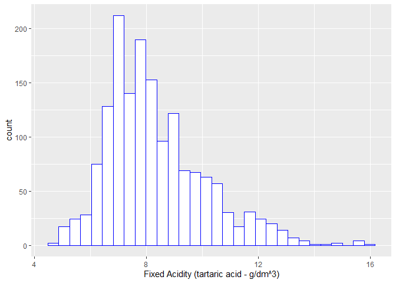
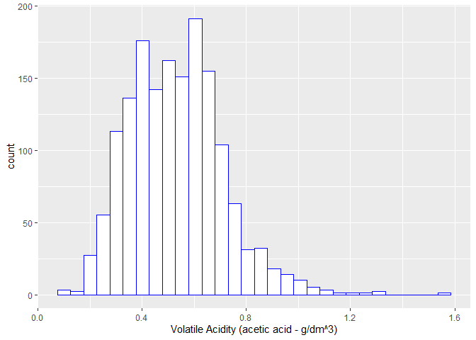
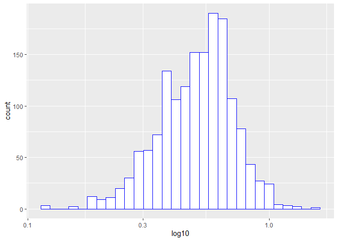
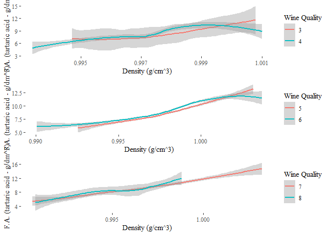

# Red Wine Analysis by Chad Hall

> This data set contains information about the various elements of red
> wine, along with its quality.

# Univariate Plots Section

    ## [1] 1599   14

    ## 'data.frame':    1599 obs. of  14 variables:
    ##  $ X                   : int  1 2 3 4 5 6 7 8 9 10 ...
    ##  $ fixed.acidity       : num  7.4 7.8 7.8 11.2 7.4 7.4 7.9 7.3 7.8 7.5 ...
    ##  $ volatile.acidity    : num  0.7 0.88 0.76 0.28 0.7 0.66 0.6 0.65 0.58 0.5 ...
    ##  $ citric.acid         : num  0 0 0.04 0.56 0 0 0.06 0 0.02 0.36 ...
    ##  $ residual.sugar      : num  1.9 2.6 2.3 1.9 1.9 1.8 1.6 1.2 2 6.1 ...
    ##  $ chlorides           : num  0.076 0.098 0.092 0.075 0.076 0.075 0.069 0.065 0.073 0.071 ...
    ##  $ free.sulfur.dioxide : num  11 25 15 17 11 13 15 15 9 17 ...
    ##  $ total.sulfur.dioxide: num  34 67 54 60 34 40 59 21 18 102 ...
    ##  $ density             : num  0.998 0.997 0.997 0.998 0.998 ...
    ##  $ pH                  : num  3.51 3.2 3.26 3.16 3.51 3.51 3.3 3.39 3.36 3.35 ...
    ##  $ sulphates           : num  0.56 0.68 0.65 0.58 0.56 0.56 0.46 0.47 0.57 0.8 ...
    ##  $ alcohol             : num  9.4 9.8 9.8 9.8 9.4 9.4 9.4 10 9.5 10.5 ...
    ##  $ quality             : int  5 5 5 6 5 5 5 7 7 5 ...
    ##  $ new_quality         : Factor w/ 6 levels "3","4","5","6",..: 3 3 3 4 3 3 3 5 5 3 ...

    ##        X          fixed.acidity   volatile.acidity  citric.acid   
    ##  Min.   :   1.0   Min.   : 4.60   Min.   :0.1200   Min.   :0.000  
    ##  1st Qu.: 400.5   1st Qu.: 7.10   1st Qu.:0.3900   1st Qu.:0.090  
    ##  Median : 800.0   Median : 7.90   Median :0.5200   Median :0.260  
    ##  Mean   : 800.0   Mean   : 8.32   Mean   :0.5278   Mean   :0.271  
    ##  3rd Qu.:1199.5   3rd Qu.: 9.20   3rd Qu.:0.6400   3rd Qu.:0.420  
    ##  Max.   :1599.0   Max.   :15.90   Max.   :1.5800   Max.   :1.000  
    ##  residual.sugar     chlorides       free.sulfur.dioxide
    ##  Min.   : 0.900   Min.   :0.01200   Min.   : 1.00      
    ##  1st Qu.: 1.900   1st Qu.:0.07000   1st Qu.: 7.00      
    ##  Median : 2.200   Median :0.07900   Median :14.00      
    ##  Mean   : 2.539   Mean   :0.08747   Mean   :15.87      
    ##  3rd Qu.: 2.600   3rd Qu.:0.09000   3rd Qu.:21.00      
    ##  Max.   :15.500   Max.   :0.61100   Max.   :72.00      
    ##  total.sulfur.dioxide    density             pH          sulphates     
    ##  Min.   :  6.00       Min.   :0.9901   Min.   :2.740   Min.   :0.3300  
    ##  1st Qu.: 22.00       1st Qu.:0.9956   1st Qu.:3.210   1st Qu.:0.5500  
    ##  Median : 38.00       Median :0.9968   Median :3.310   Median :0.6200  
    ##  Mean   : 46.47       Mean   :0.9967   Mean   :3.311   Mean   :0.6581  
    ##  3rd Qu.: 62.00       3rd Qu.:0.9978   3rd Qu.:3.400   3rd Qu.:0.7300  
    ##  Max.   :289.00       Max.   :1.0037   Max.   :4.010   Max.   :2.0000  
    ##     alcohol         quality      new_quality
    ##  Min.   : 8.40   Min.   :3.000   3: 10      
    ##  1st Qu.: 9.50   1st Qu.:5.000   4: 53      
    ##  Median :10.20   Median :6.000   5:681      
    ##  Mean   :10.42   Mean   :5.636   6:638      
    ##  3rd Qu.:11.10   3rd Qu.:6.000   7:199      
    ##  Max.   :14.90   Max.   :8.000   8: 18

  - The dataset contains 14 variables.
  - The first variable, x, is a unique identifier and sequenced count. I
    will not be including it in any of the analysis.
  - I have added a new variable, new\_quality, which is factored copy of
    the quality varaible. This will assist in some analysis later.
  - There are almost 1600 observations.

<!-- -->

Most of the observations are around 6-11. There are a very low ammount
of observations that are between 14-16. The lowest count of observations
lies around 14. Later, I may want to see if this variable has any
correlation to other acidity levels or pH level.

<!-- -->

The volatile acidity is already looking slightly similar to the fixed
acidity. It is looking like higher acidity wines are less avaialable.

<!-- -->

Once again, higher acid levels fall off. It may be the case that wines
with more acid are of lower quality. It will be interesting to see how
quality and acidity go together.

<!-- --><!-- -->

Most of the observations fall on the lower scale of residual sugar. This
is between 0.5 and 6. So far, it seems that less is more when it comes
to wine. The distirbution seems to have a slight skew to it.

<!-- --><!-- -->

Chlorides seems to be staying the course so far. Most observations on
the low end of the value range. The original histogram was over
overdistributed, so I used a log10 scale to better see the distribution.
The values end up being more normally distributed when I use this scale.

<!-- --><!-- -->

<!-- --><!-- -->

These two seem to go hand-in-hand. The reason being that free sulfur
dioxide would be included in the total sulfur dioxide. As such, their
distribution looks very similar. I wonder how free sulfur dioxide
affects quality though up against total sulfur dioxide.

<!-- -->

    ##    Min. 1st Qu.  Median    Mean 3rd Qu.    Max. 
    ##  0.9901  0.9956  0.9968  0.9967  0.9978  1.0037

The density of red wine seems to have a very normal distribution. The
median is .997 and the mean is .997. Most observations are very close to
this number.

<!-- -->

The pH of red wine also has a very normal distribution. I wonder if the
pH will fall in line with the acidity levels in other variables.

<!-- --><!-- -->

The original histogram suffers from overdistribution. When we transform
using log10, we can see for the most part a normal distribution with a
slight skew.

<!-- -->

Most observations are around 9 to 10. I wonder if alcohol content has
any thing to do with the other variables, such as if they tend to put
more acid into a higher alcohol content wine.

<!-- -->

    ##    Min. 1st Qu.  Median    Mean 3rd Qu.    Max. 
    ##   3.000   5.000   6.000   5.636   6.000   8.000

Here we have the quality of the wine. It is integer based as we can see
from the histogram. The mean quality is 5.64 and the median quality is
6.

# Univariate Analysis

### What is the structure of your dataset?

There are 1599 different wine observations, and 13 variables. The
variables are x, fixed acidity, volatile acidity, ciric acid, residual
sugar, chlorides, free sulfur dioxide, total sulfur dioxide, density,
pH, sulphates, alcohol, and quality. The x variable is an identifier
sequence. Quality is an integer that is used to grade the alcohol. The
rest of the variavlves are measurements. Some thoughts about the
dataset:

  - The median quality is 6.
  - The mean quality is 5.64.
  - The maximum alcohol content is 14.9, while the mean is 10.42.

### What is/are the main feature(s) of interest in your dataset?

The main features I am interested is how well everything correlates with
quality. Since quality is the ‘judging’ factor in this, what makes a
good wine? What makes a poor quality wine?

### What other features in the dataset do you think will help support your investigation into your feature(s) of interest?

I think that after I look at the correlation, I can see more places of
interest to compare to quality and alcohol content of wines.

### Did you create any new variables from existing variables in the dataset?

Yes. I created a new variable new\_quality. This is a factored version
of the quality column. This will assist me in easier plotting later.

### Of the features you investigated, were there any unusual distributions? Did you perform any operations on the data to tidy, adjust, or change the form of the data? If so, why did you do this?

Several of the variables had long tails on them and strange
distributions. I found it helpful to transform the data using log and I
was able to get a better view of the distribution.

# Bivariate Plots Section

<!-- -->

From the correlation chart, we can see quality has a strong positive
correlation with alcohol, and a strong negative correlation with
volatile acidity.

#### Alcohol and Quality

<!-- --><!-- -->

#### Correlation/Summary

    ## [1] 0.4761663

    ## rwine$quality: 3
    ##    Min. 1st Qu.  Median    Mean 3rd Qu.    Max. 
    ##   8.400   9.725   9.925   9.955  10.575  11.000 
    ## -------------------------------------------------------- 
    ## rwine$quality: 4
    ##    Min. 1st Qu.  Median    Mean 3rd Qu.    Max. 
    ##    9.00    9.60   10.00   10.27   11.00   13.10 
    ## -------------------------------------------------------- 
    ## rwine$quality: 5
    ##    Min. 1st Qu.  Median    Mean 3rd Qu.    Max. 
    ##     8.5     9.4     9.7     9.9    10.2    14.9 
    ## -------------------------------------------------------- 
    ## rwine$quality: 6
    ##    Min. 1st Qu.  Median    Mean 3rd Qu.    Max. 
    ##    8.40    9.80   10.50   10.63   11.30   14.00 
    ## -------------------------------------------------------- 
    ## rwine$quality: 7
    ##    Min. 1st Qu.  Median    Mean 3rd Qu.    Max. 
    ##    9.20   10.80   11.50   11.47   12.10   14.00 
    ## -------------------------------------------------------- 
    ## rwine$quality: 8
    ##    Min. 1st Qu.  Median    Mean 3rd Qu.    Max. 
    ##    9.80   11.32   12.15   12.09   12.88   14.00

From looking at this correlation, we can see that the mean alcohol
content of higher quality alcohols is higher. It is also capable of
seeing that there are fewer high quality alcohols. Also, it can be seen
that the average alcohol level is higher in the higher quality alcohols
when looking at each quality rating’s mean.

#### Quality/Volatile Acidity

<!-- --><!-- -->

#### Correlation/Summary

    ## [1] -0.3905578

    ## rwine$quality: 3
    ##    Min. 1st Qu.  Median    Mean 3rd Qu.    Max. 
    ##  0.4400  0.6475  0.8450  0.8845  1.0100  1.5800 
    ## -------------------------------------------------------- 
    ## rwine$quality: 4
    ##    Min. 1st Qu.  Median    Mean 3rd Qu.    Max. 
    ##   0.230   0.530   0.670   0.694   0.870   1.130 
    ## -------------------------------------------------------- 
    ## rwine$quality: 5
    ##    Min. 1st Qu.  Median    Mean 3rd Qu.    Max. 
    ##   0.180   0.460   0.580   0.577   0.670   1.330 
    ## -------------------------------------------------------- 
    ## rwine$quality: 6
    ##    Min. 1st Qu.  Median    Mean 3rd Qu.    Max. 
    ##  0.1600  0.3800  0.4900  0.4975  0.6000  1.0400 
    ## -------------------------------------------------------- 
    ## rwine$quality: 7
    ##    Min. 1st Qu.  Median    Mean 3rd Qu.    Max. 
    ##  0.1200  0.3000  0.3700  0.4039  0.4850  0.9150 
    ## -------------------------------------------------------- 
    ## rwine$quality: 8
    ##    Min. 1st Qu.  Median    Mean 3rd Qu.    Max. 
    ##  0.2600  0.3350  0.3700  0.4233  0.4725  0.8500

Looking at this correlation between quality and volatile acidity, it
seems that usually high quality wines are of a lower acidity.

#### Alcohol/Density

<!-- -->

#### Correlation

    ## [1] -0.4961798

Looking at the graph, there is a strong negative correlation in density
and alcohol. As the alcohol content gets higher, generally the density
is reduced. It would also seem that most alcohols are of around 9.5
alcohol content.

#### Fixed Acidity/Density

<!-- -->

#### Correlation

    ## [1] 0.6680473

The plot shows that as acidity rises, generally so does density. There
tend to be a strong positive correlation here. I think that it will be
interesting to see how this looks when it is matched with other variabls
in the multivariate analysis.

# Bivariate Analysis

### Talk about some of the relationships you observed in this part of the investigation. How did the feature(s) of interest vary with other features in the dataset?

Using the correlation plot, I was able to select out which relationships
to observe. I selected out relationships with strong correlation. I am
especially interested in alcohol vs quality. Since wine has such varying
alcohol content and price, I wonder how this alcohol affects the
quality, and if higher quality alcohols have higher or lower quality
than others.

### Did you observe any interesting relationships between the other features (not the main feature(s) of interest)?

I am also intereted in exploring the volatile acidity levels and the
fixed acidity levels. I was able to see correlation between the quality
of the alcohol. Also the density of the alcohol seems to have an
interesting correlation to alcohol content, which may also lead to
discoveries about the density for different wine qualities.

### What was the strongest relationship you found?

The strongest correlation in the correlation plot was fixed acidity to
pH. I would rather not use this one later, as pH is an acidity scale
itself. The strongest correlation that I am interested in in density and
fixed acidity.

# Multivariate Plots Section

<!-- -->

From this density plot, we can see how all of the different quality
wines measure when when it coems to alcohol content. Quality 3’s, 4’s,
and 5’s tend to stay below 12, while the higher quality ones have a
better chance of being 10 and above.

<!-- -->

Creating two new data frames, I am able to zoom in to the areas of the
plot that have alcohol greater than or equal to 12 and less than 12.
Zooming in the the alcohol that is less than 12, we can see that most of
the alcohols have a solid distribution acorss this range.

<!-- -->

From zooming in to the alcohol above 12, we can actually see that
quality 5 alcohols show up around 13 and 15. In the previous graphs this
was very hard to see, but we can also see that quality 8 has the widest
spread in the range.

<!-- -->

Now, when we look at a density plot for the lowest quality and the
highest quality alcohol after creating the new data frame for this, we
can see that the lowest quality tends to have more concentration on the
lower end, and the higher quality tends to have more concentration on
the higher end.

<!-- -->

From this chart we can check out the density of volatile acidity based
on the quality of the wine. From this chart, it would seem that most
higher quality wines have a lower volatile acidity.

<!-- -->

Here, looking at the volatile acidity density between qualities of wine,
we can see that usually a higher quality wine has a lower volatile
acidity. With the line graph, we can see a sharp decline in the mean
volatile acidity based on the quality of wine.

<!-- -->

<!-- -->

As we can see from these group of charts, the density and fixed acidity
(F.A.) from the bivariate charts section holds true. As the density
increases, the fixed acidity generally increases.

# Multivariate Analysis

### Talk about some of the relationships you observed in this part of the investigation. Were there features that strengthened each other in terms of looking at your feature(s) of interest?

There were some very interesting observations in this section. The plots
revealed some interesting information about correlations in the data
set. As quality increases, alcohol content increases, and at the same
time fixed acidity and wine density decrease. So generally, it seems
that higher quality wines have higher alcohol content while having lower
densit and fixed acidity.

### Were there any interesting or surprising interactions between features?

Yes, the whole relationship between volatile acidity and quality seemed
to follow a similar trend to quality and fixed acidity.

-----

# Final Plots and Summary

### Plot One

<!-- -->

### Description One

Generally, the wine density decreases as the alcohol content increases.
This makes me wonder, does alcohol content itself lower density? Is
something put in place of the additional alcohol to make the density
higher, and does this have a higher density than alcohol as a substance?

### Plot Two

<!-- -->

### Description Two

Here we can see that the distribution of alcohol content of the lowest
quality wine is mainly to the left of the chart while the highest
quality is to the right. Higher quality wine has alcohol contents
ranging from the lowest to the highest alcohol content values on the
chart, while lower alcohols stop short around an alcohol content of 12.

### Plot Three

<!-- -->

### Description Three

With this plot, we charted the fixed acidity level based on the wine
density. We can see that as the wine density rises, the fixed acidity
also rises. Seeing where each of the wine quality lines stop, we can see
that the highest quality wines stop very short of the maximum density.

-----

# Reflection

Through exploration of the red wine data set, I found that ‘more is
less’ when it comes to quality of the wine. After looking through the
histograms, I thought that it would be much better to view the data on a
correlation plot. After viewing the data, I made selections based on
correlations that I found present. Several correlations that I notice, I
threw out of the posibility of analyzing. These were variables that
seemed like they would be a double of the information already provided,
or just did not seem interesting to the analysis (i feel that variables
such as acidity, alcohol content, and acidity are factors in the data
that you can actually taste or affect your enjoyment of the wine). From
here, I wanted to see how each variable interacted with each other and
how they also interacted with the quality of a wine. Through this I was
able to get a limited idea of what a high quality wine consists of.

From the data presented here, I wanted to get a an idea of a few points
that make a quality wine. Low acidity and low density seem to be very
interesting results when it comes to a higher quality wine. Alcohol
content also seems to play a factor, but the high quality wine is still
distributed over all alcohol contents. It still does tend to have a
heavier distribution leaning towards the higher alcohol content. There
was a positive trend between density and acidity, and a positive trend
between alcohol content and quality. This resulted in a negative trend
between the two sets aforementioned.

Several limitations are present in this data set. The data is only based
on red wine varients of the Portuguese ‘Vinho Verde’. The results may
have been different with a different type of wine. Also, since there is
no brand infomation, grape type, or wine prices available, we cannot
look at these variables. It could even mean that the highest quality
wines are made by only a select few brands, or that certain grape types
introduce more acidity or density into the wine. Price would also be
nice, because the price may also affect the alcohol content of the wine
(as higher alcohol content may result in a higher priced product).

For future analysis, I may want to see if there is a total content that
each wine has individually. By this, I mean how much acid, how much
sulfur, how much chloride is in a wine. This may shed some light on the
denstity of each of the wines, and may shed some light on why the
acidity and density trend down as alcohol content trends upwards.
